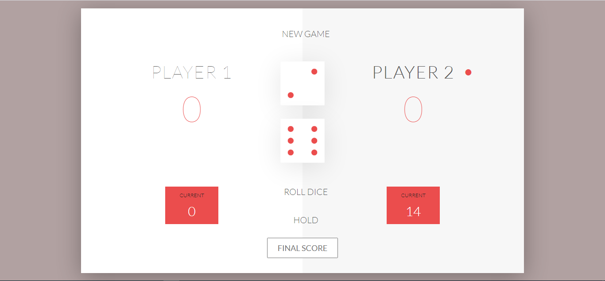

# dicefungame
A dice fun game to play with Friends and love ones

Additional description about the project and its features.

This project was designed to fulfill the following concepts:

- Dice Fun Game which can be played between two people at a time

## Built With

- HTML
- CSS
- JavaScript

## Live Demo

[Live Demo Link](https://happiguru.github.io/dicefungame/)

[Github Repository Link](https://github.com/happiguru/dicefungame)

## Getting Started

This project requires the use of web browser. It can be run both locally and on the web. 
You can find a live demo [here](https://happiguru.github.io/dicefungame/)

To get a local copy up and running follow these simple example steps.

### Prerequisites

- Browser (Google Chrome, Mozilla Firefox, Safari or any other browser)

### Setup

- Download or clone the repository's files
- Open the index.html file using any web browser of your choice

## Authors

👤 **Author1**

- Github: [@happiguru](https://github.com/happiguru)
- Twitter: [@Lekunze_Nle](https://twitter.com/Lekunze_Nley)
- Linkedin: [lekunze-nley](https://www.linkedin.com/in/lekunze-nley/)

## 🤝 Contributing

Contributions, issues and feature requests are welcome!

Feel free to check the [issues page](issues/).

## Show your support

Give a ⭐️ if you like this project!

## Acknowledgments

- Hat tip to anyone whose code was used
- Inspiration
- etc

## 📝 License

This project is [MIT](LICENSE) licensed.